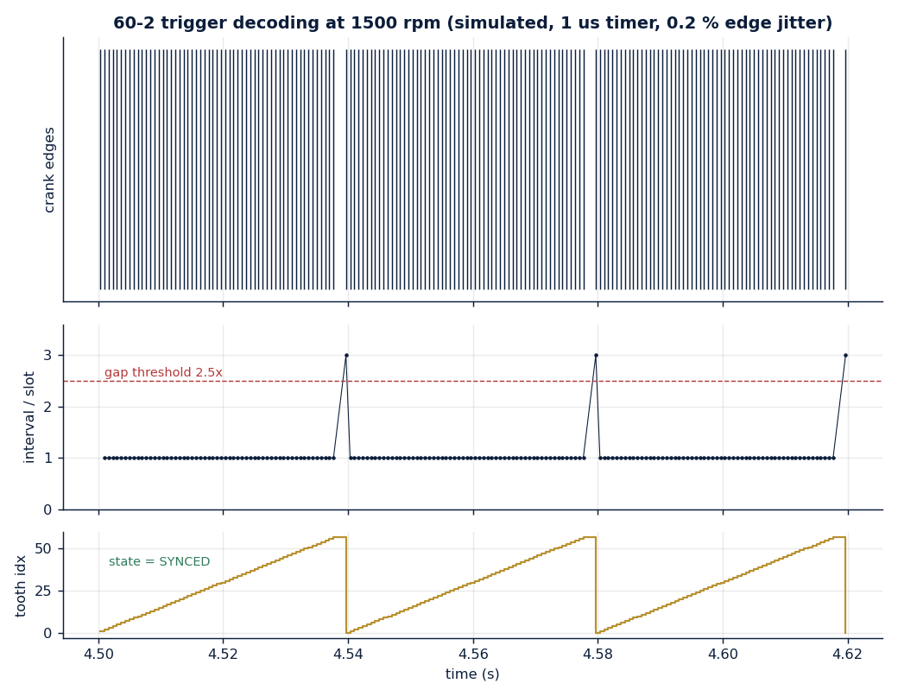
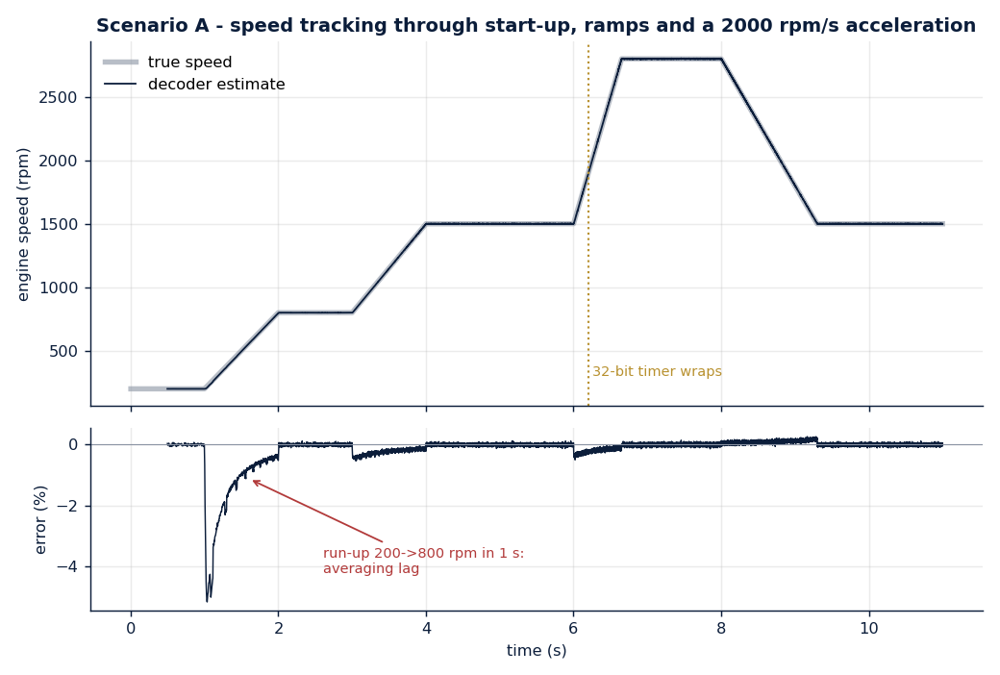
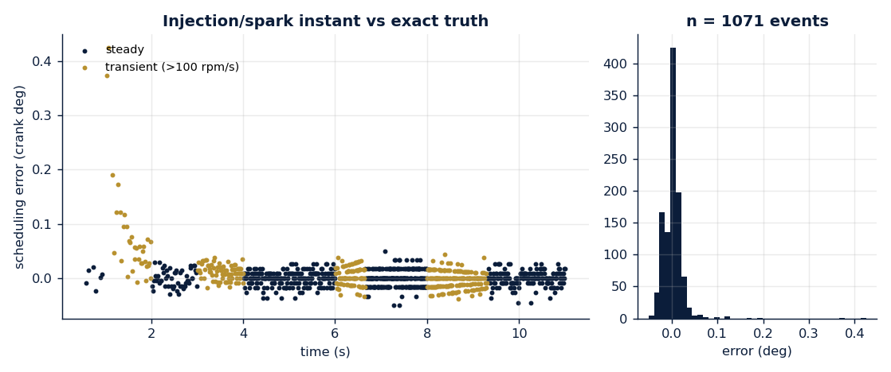
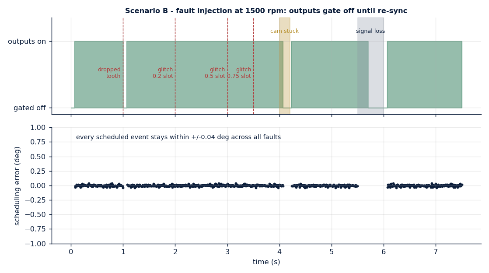
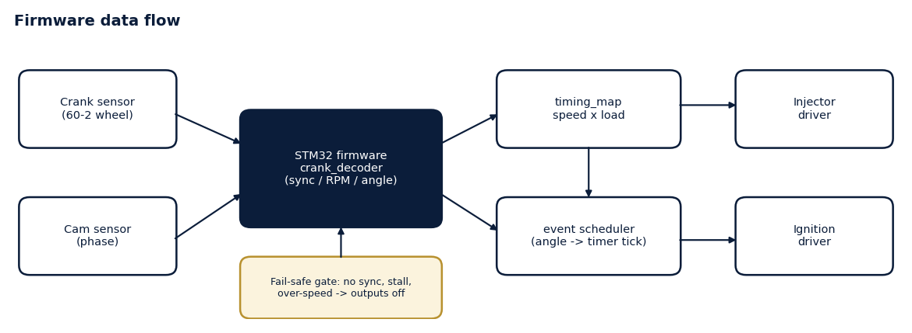
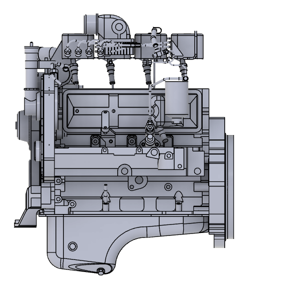
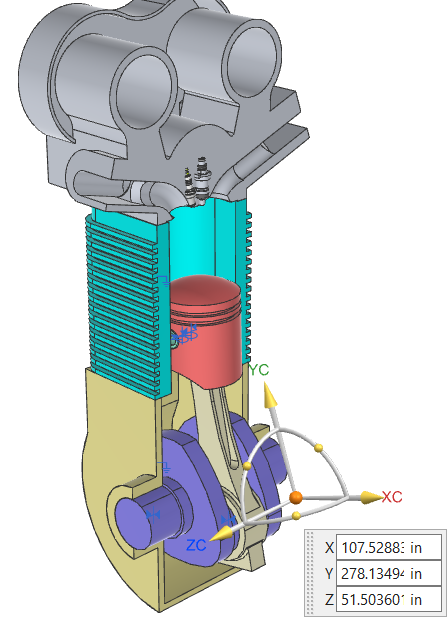

# Hydrogen IC Engine Retrofit - Engine-Control Firmware & Verification


Engine-control firmware core for a hydrogen retrofit of existing diesel-cycle
(compression-ignition) engines used in gensets and heavy commercial vehicles.
The retrofit replaces the compression-ignition fuel path with spark-assisted
direct gaseous injection while keeping the mechanical short-block, which makes
precise, crank-angle-based injection and ignition timing the heart of the
control problem. This repository contains that timing core, its host-side
verification bench and the results.

Developed under **HERRSCHER Mobility**. Proprietary fuel formulation, hardware
designs and calibration data are not part of this repository.

---

## Results

Measured on a simulated 4-cylinder engine with a 60-2 crank wheel and cam
sensor (1 MHz timer, 0.2 % Gaussian edge jitter). Timing errors are the
decoder's scheduled injection/spark instant against the exact simulated crank
position.

| Metric | Result |
|---|---|
| Test-bench checks | **18 / 18 passing** |
| Time to synchronise from a cold start | 1.66 crank revolutions |
| Speed error, steady state | max 0.41 % (99th percentile 0.09 %) |
| Speed error during acceleration (>= 800 rpm, up to 2000 rpm/s) | max 0.53 % |
| Injection/spark timing error, steady state | max 0.050 deg (sd 0.014 deg) |
| Injection/spark timing error during acceleration | max 0.43 deg |
| Events scheduled in the clean run | 1071, none off by more than 1 deg |
| Fault run (dropped tooth, 3 glitches, stuck cam, signal loss) | 662 events, max error 0.036 deg; faults that break synchronisation gate the outputs off, glitches are rejected without interruption |
| Recovery after a fault clears | 0.7 - 1.7 crank revolutions |
| Over-speed gating (3200 rpm limit) | outputs off every time, decoder stays synchronised to 3400 rpm |
| Timer wrap-around | handled (32-bit timer wraps during the hard acceleration) |

One figure deserves a note: during the extreme 200 -> 800 rpm cranking run-up
(a fourfold speed change in one second) the 8-edge speed average lags by up to
5.1 %. This affects the displayed/map-lookup speed only for that interval; the
scheduled timing error stays within the figures above.


*60-2 gap detection: the missing teeth appear as a 3x interval; the decoder's
tooth index resets at each gap.*






*Faults that break synchronisation gate the outputs off until the decoder has
re-synchronised; the three glitches are rejected without interruption. No event
is fired with a wrong angle.*

---

## What is in this repository

| Part | Description |
|---|---|
| `firmware/core/crank_decoder.[ch]` | 60-2 decoder: gap detection, two-gap sync validation with cam phase (720 deg), speed estimate, interpolated crank angle, angle-to-time event scheduling with one-shot latch, glitch/dropout/stall/cam/over-speed protection, fail-safe output gate |
| `firmware/core/timing_map.[ch]` | Speed x load map with bilinear interpolation for injection start and spark timing |
| `firmware/tests/test_bench.c` | Virtual engine and fault injector; compares decoder output to simulated truth; 18 automated checks |
| `firmware/stm32/stm32_port.c` | STM32 HAL glue: timer input capture, output-compare event queue, 1 kHz stall polling |
| `simulation/make_plots.py` | Generates all figures from the bench data |
| `docs/firmware-design.md` | State machine, fault table and design notes |
| `results/` | Test report, raw CSV data and plots |



### Fault handling

| Fault | Detection | Response |
|---|---|---|
| Spurious tooth edge | interval below 0.6 x slot period | edge ignored |
| Dropped tooth | interval above 1.5 x slot period away from the gap | sync dropped, outputs off |
| Missing or early gap | tooth count != 58 between gaps | sync dropped, outputs off |
| Cam signal fault | cam level does not alternate between gaps | sync dropped, outputs off |
| Signal loss / stall | no edge for 200 ms | state reset, outputs off |
| Over-speed | speed above limit | outputs off until below limit minus hysteresis |

---

## Run it

```bash
make test     # builds with gcc and runs the bench (needs gcc, make)
make plots    # regenerates the figures (needs python3, numpy, matplotlib)
```

The bench exits non-zero if any check fails; GitHub Actions runs it on every
push.

---

## Engine platform


*Donor engine CAD.*


*Combustion chamber, piston and spark-plug integration reference (CAD,
indicative geometry).*

---

## Verification scope

- All results above come from simulated signals on a host computer. Sensor
  conditioning, wheel tooth tolerance and electrical noise are not modelled;
  edge jitter is Gaussian.
- Reported timing errors are those of the decoder and scheduler. Injector,
  coil and driver latencies and sensor mounting error are outside this
  measurement.
- `stm32_port.c` is a reference port. It type-checks against a HAL stub; it has
  not been executed on hardware in this repository.
- The values in `timing_map.c` are illustrative demonstration values used to
  exercise the lookup. They are not an engine calibration.
- The decoder targets 4-stroke engines with a 60-2 wheel and a cam level
  sampled at the gap.
- This repository contains no engine test-cell, emissions or performance data.

---

## Intellectual property and disclaimer

This repository is a technical portfolio of non-confidential engineering work.
Fuel formulation, injector and hardware designs, pressure-system design,
calibration maps and unpublished experimental data are intentionally excluded.
It is not a construction or operating manual for hydrogen fuel systems or
modified engines; any physical implementation involving hydrogen or engine
modification requires certified components, laboratory safety procedures and
qualified supervision.

---

## Author

**Arun Roshan A S**
Automotive R&D | Powertrain & Combustion | Hydrogen IC Engines | ECU & Embedded Systems
HERRSCHER Mobility
