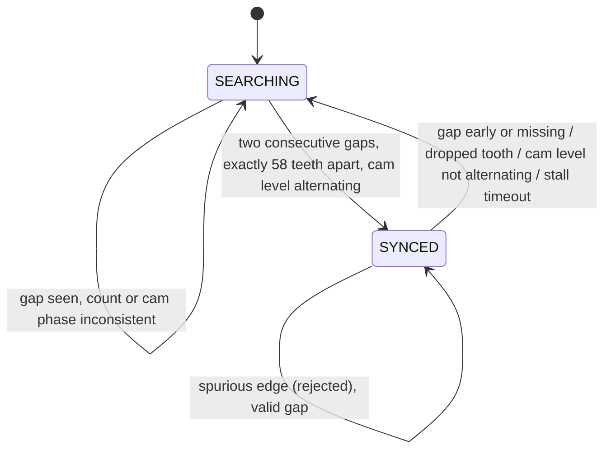

# Crank decoder - design notes

Source: `firmware/core/crank_decoder.c`. Hardware independent; consumes
`(timestamp, cam level)` pairs.

## Trigger wheel

60-2 wheel: 60 slots at 6 deg pitch, two slots removed, so 58 teeth per crank
revolution. Tooth 0 is the first tooth after the gap. A cam level sampled at
each gap gives the 720 deg cycle phase.

## Synchronisation

| Condition (while SYNCED) | Rule | Response |
|---|---|---|
| Interval < 0.6 x slot period | spurious edge | edge ignored, `glitch_count++` |
| Interval > 1.5 x slot away from the gap | dropped tooth | sync dropped immediately, `dropout_count++` |
| Gap where tooth 57 -> 0 is not due, or no gap when due | tooth-count mismatch | sync dropped, `sync_loss_count++` |
| Cam level at gap does not alternate | cam fault | sync dropped, `cam_fault_count++` |
| No edge for 200 ms (configurable) | stall | state reset, `stall_count++` |
| Speed above limit | over-speed | outputs gated off until below limit minus hysteresis |

Outputs (`outputs_enabled`) are true only while SYNCED, not over-speed and
speed is known. Every fault above therefore leaves the outputs off until the
decoder has re-acquired.

## Speed and angle

Speed comes from an 8-edge window: `rpm = tick_hz * slots / sum(dt)`, where the
gap interval counts as 3 slots. The window average lags a fast speed change;
the measured effect is reported in the README.

Interpolated crank angle at time `t` is the last tooth angle plus
`6 deg * (t - t_tooth) / slot_ticks`.

## Event scheduling

`cd_schedule()` is called after each tooth. If the requested cycle angle lies
in the interval that follows the tooth (6 deg, or 18 deg after tooth 57), it
returns the timer tick to fire at. `cd_event_update()` wraps it in a one-shot
latch so an event fires once per 720 deg cycle even though its angle (taken
from the timing map) moves slightly between teeth. All timer arithmetic is
modular `uint32_t`, so timer wrap-around needs no special handling (scenario A
wraps the timer during the hard acceleration).

## Timing map

`firmware/core/timing_map.c` - bilinear lookup over speed x load with edge
clamping. The table values are illustrative demonstration values used to
exercise the lookup; they are not an engine calibration.

## Bugs found by the test bench while developing

1. Stall polling used an unsigned age; an edge time-stamped a few
   microseconds after the poll's "now" produced a huge value and reset the
   decoder continuously. Fixed with a signed age.
2. After a dropped tooth the stale previous interval made the glitch filter
   reject every second edge forever. Fixed by clearing the interval on
   sync loss and by classifying intervals against the previous interval while
   searching.
3. A consistently inverted cam signal is indistinguishable from a correct one
   by the cam signal alone, so the cam fault scenario uses a stuck signal,
   which the alternation check does detect.
